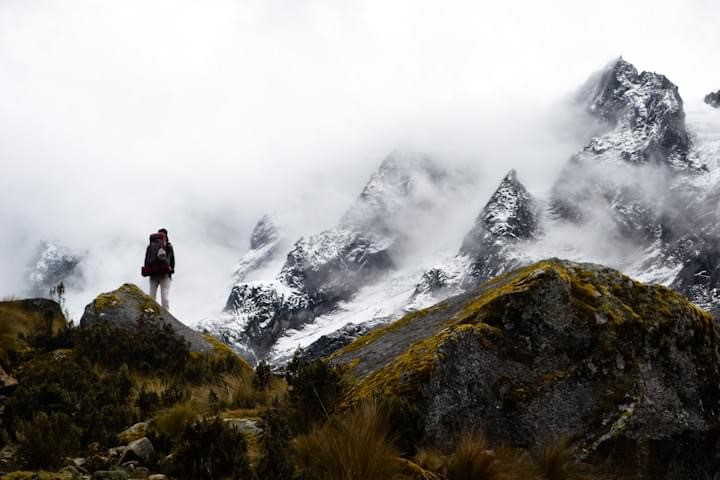

   

# Personal interests

I have always placed great importance in spending time in nature as much as possible. Hiking on trips, camping in National Parks, or backpacking internationally continues to provide incredible sights and experiences that are unmatched by any metropolitan site. 

In addition to travelling to natural sites, I am also a recent fanatic of house plants. To help provide some greenery while living in Brooklyn, my partner and I have taken on responsibility for over 40 plants in our small one bedroom apartment. If you are every in need of a some green leaves in your life, feel free to ask. 

# Personal goals

Outside of work aspirations, I continually aim to motivate myself to pursue personal goals. One such goal is to become a skilled home cook. After spending four years in undergrad eating only canned pasta sauce and spaghetti, I have realized that life is much more liveable when you invest in good meals. I am also looking to share recipes or taste new flavors. As this site progresses, I may formalize my recipe spreadshet and embedded here. 

Lastly, I am also picking up an instrument for the first time in my life! i recently commandeered a friend's old childhood keyboard and have started teaching myself the basics. However, youtube tutorials and "Piano 101" bbooks can only get me so far. If you know someone that offers lessons (for cheap!) let me know. 