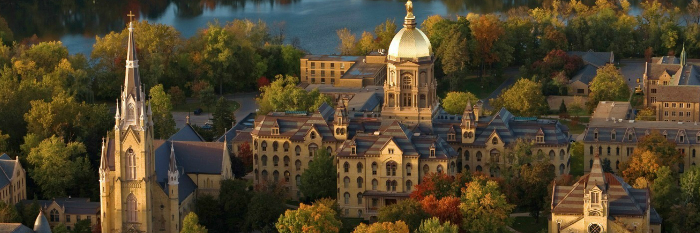

My education background consists of public health and premedical studies with an emphasis on sociology. For an summary of my coursework please see below   

## Columbia University: 2019 - 2021

   

While at Mailman School of Public Health I have done all sorts of amazing things. Filler text Filler text Filler text Filler text Filler text Filler text Filler text Filler text Filler text Filler text Filler text Filler text Filler text Filler text Filler text Filler text Filler text Filler text Filler text Filler text Filler text Filler text Filler text Filler text Filler text Filler text Filler text Filler text Filler text Filler text Filler text Filler text Filler text Filler text Filler text Filler text Filler text 
 

### Courses {.tabset}

#### Epidemiology

* Foundations of Epidemiology

#### Biostatistics

* Analysis of categorical data
* Data science

#### Programming

* Life course

   

## University of Notre Dame : 2013 - 2017

   

Filler text Filler text Filler text Filler text Filler text Filler text Filler text Filler text Filler text Filler text Filler text Filler text Filler text Filler text Filler text Filler text Filler text Filler text Filler text Filler text Filler text Filler text Filler text Filler text Filler text Filler text Filler text Filler text Filler text Filler text Filler text Filler text Filler text Filler text Filler text Filler text Filler text Filler text Filler text Filler text Filler text Filler text Filler text Filler text 

 

### Courses {.tabset}

#### Natural Sciences

* Foundations of Epidemiology

#### Social Sciences

* Analysis of categorical data
* Data science

#### Math & Statistics

* Life course
