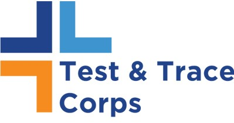

While still early in my career, I have held a variety of professional positions since college graduation. 

## NYC Health & Hospitals' Test & Trace Corps

   

### COVID-19 Case Investigator

As a contact tracer for NYCHHC I have conducted over 500 interviews with laboratory confirmed COVID-19 cases, presumed cases, and close contacts. As a contact tracer for NYCHHC I have conducted over 500 interviews with laboratory confirmed COVID-19 cases, presumed cases, and close contactsAs a contact tracer for NYCHHC I have conducted over 500 interviews with laboratory confirmed COVID-19 cases, presumed cases, and close contacts

## City Year New York

   

### Impact Manager 

As an impact manager with City Year NYC As an impact manager with City Year NYCAs an impact manager with City Year NYCAs an impact manager with City Year NYCAs an impact manager with City Year NYCAs an impact manager with City Year NYCAs an impact manager with City Year NYCAs an impact manager with City Year NYCAs an impact manager with City Year NYCAs an impact manager with City Year NYC

### AmeriCorps Member

As an AmeriCorps Member with City Year NYC As an impact manager with City Year NYCAs an impact manager with City Year NYCAs an impact manager with City Year NYCAs an impact manager with City Year NYCAs an impact manager with City Year NYCAs an impact manager with City Year NYCAs an impact manager with City Year NYCAs an impact manager with City Year NYCAs an impact manager with City Year NYC